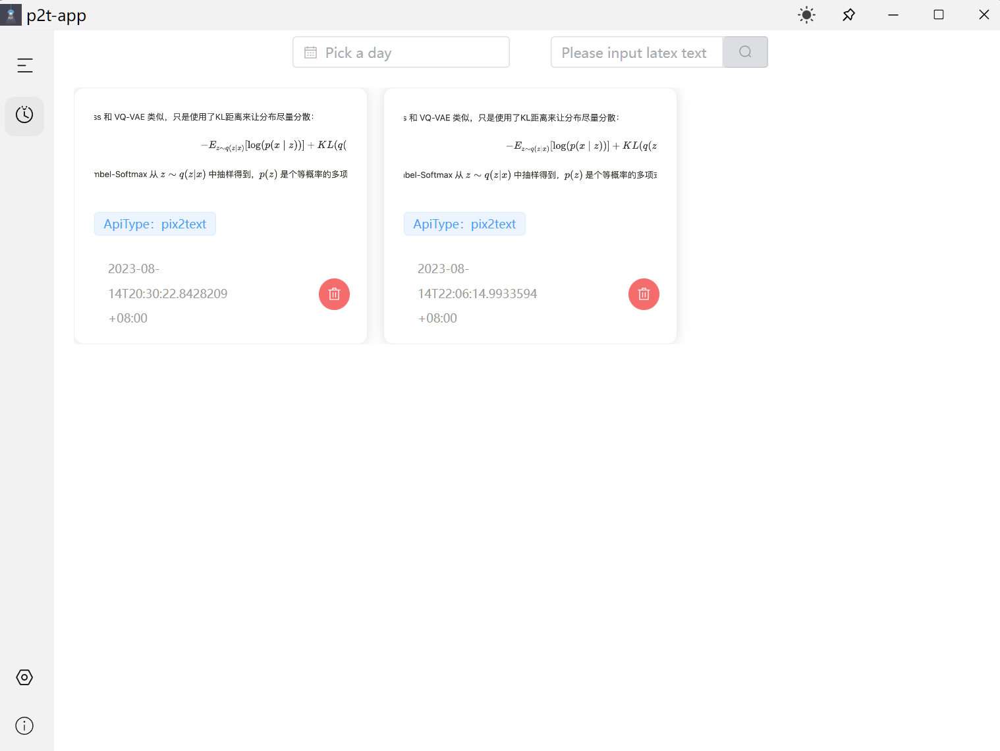
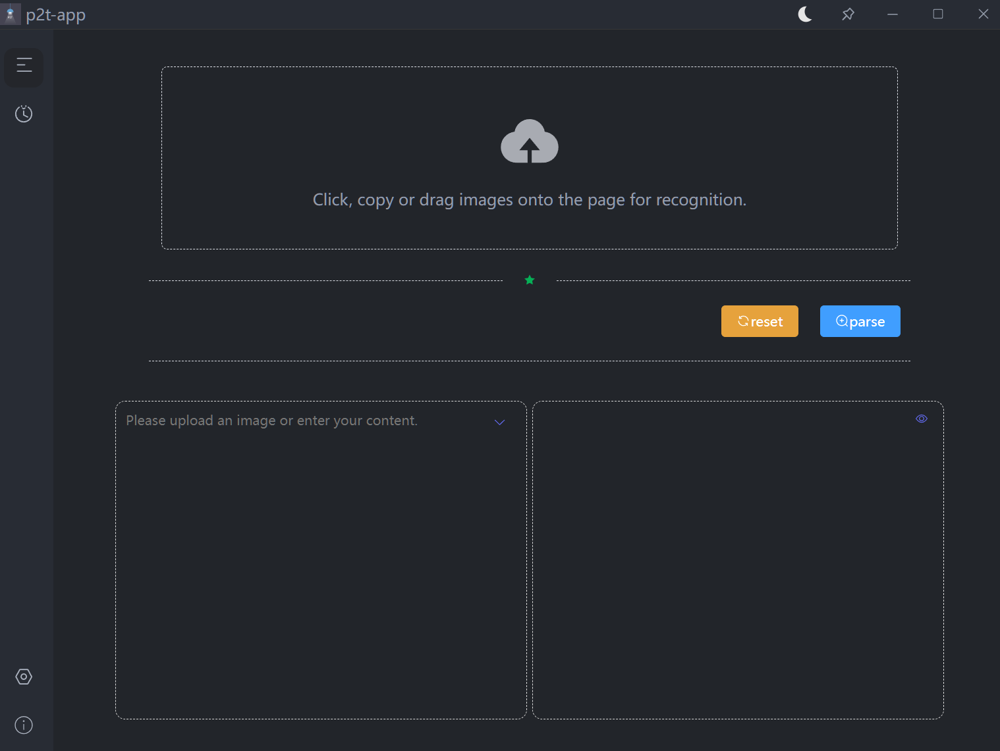

# p2t-app
Mathpix 开源版 p2t-app

`p2t-app`是基于`Pix2Text`开发的，目前用的是Pix2Text的api，后面随着功能的完善，或尝试把模型部署本地进行推理预测。

Pix2Text 期望成为 `Mathpix` 的免费开源 Python 替代工具，目前已经可以完成 Mathpix 的核心功能。Pix2Text (P2T) 自 V0.2 开始，支持识别既包含文字又包含公式的混合图片，返回效果类似于 Mathpix。

目前p2t-app开发了一些基本功能，后续会补充剩下的功能。

欢迎大家提建议与找bug，帮助软件的完善。

下面是我的公众号，有任何反馈可以在这上面反馈


## 项目地址
### p2t-app地址
```
https://github.com/Esword618/p2t-app
```
### Pix2Text地址
```
https://github.com/breezedeus/Pix2Text
```
### wails地址
```
https://github.com/wailsapp
```
## 项目已开发界面
### 上传界面


### 历史记录


### 暗黑模式界面


